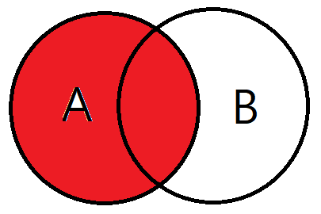
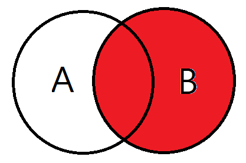
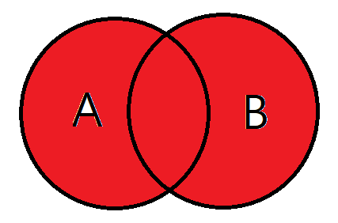

## [DB] JOIN

#### 조인이란?

> 두개 이상의 테이블이나 데이터베이스를 연결하여 데이터를 검색하는 방법

테이블을 연결하려면, 적어도 하나의 칼럼을 서로 공유하고 있어야 하므로 이를 이용하여 데이터 검색에 활용한다.

<br>

## JOIN 종류

- INNER JOIN
- LEFT OUTER JOIN
- RIGHT OUTER JOIN
- FULL OUTER JOIN

<br>

<br>

- #### INNER JOIN


> 교집합으로, 기준 테이블과 join 테이블의 중복된 값을 보여줍니다.  
> 명령어로 INNER JOIN 대신 JOIN 만을 입력해도 INNER JOIN이 사용됩니다.

```sql
SELECT
A.NAME, B.AGE
FROM EX_TABLE A
INNER JOIN JOIN_TABLE B ON A.NO_EMP = B.NO_EMP
```

  <br>

- #### LEFT OUTER JOIN



> 기준 테이블의 값 + 조인 테이블의 값을 보여줍니다.  
> 왼쪽 A테이블의 모든 데이터와 A테이블과 B테이블의 중복되는 값이 검색됩니다.

```SQL
SELECT
A.NAME, B.AGE
FROM EX_TABLE A
LEFT OUTER JOIN JOIN_TABLE B ON A.NO_EMP = B.NO_EMP
```

  <br>

- #### RIGHT OUTER JOIN



> 오른쪽 B테이블의 모든 데이터와 A테이블과 B테이블의 중복되는 값이 검색됩니다.

```SQL
SELECT
A.NAME, B.AGE
FROM EX_TABLE A
RIGHT OUTER JOIN JOIN_TABLE B ON A.NO_EMP = B.NO_EMP
```

  <br>

- #### FULL OUTER JOIN



> A와 B 테이블의 모든 데이터가 검색됩니다.  
> 합집합으로 사실상 기준테이블의 의미가 없습니다.

```sql
SELECT
A.NAME, B.AGE
FROM EX_TABLE A
FULL OUTER JOIN JOIN_TABLE B ON A.NO_EMP = B.NO_EMP
```
