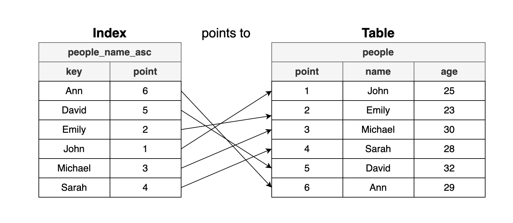

# 인덱스(Index)

## 인덱스란?

데이터베이스 인덱스(Index)는  
**데이터 검색 속도를 향상시키기 위한 자료구조**입니다.

특정 컬럼의 값과 해당 레코드의 위치를 매핑하여  
전체 테이블을 조회하지 않고 빠르게 데이터를 찾을 수 있도록 합니다.

> 책의 **목차/색인**과 같은 역할

<br>



> 이름 순으로 정렬된 인덱스

<br>

## 인덱스(Index)는 왜 사용할까? (장점)

### 1. 조건 검색 (WHERE) 성능 향상

- 일반 테이블 → Full Table Scan 발생
- 인덱스 → 조건에 맞는 데이터 범위를 빠르게 탐색

> 검색 성능 크게 향상

<br>

### 2. 정렬 (ORDER BY) 성능 향상

- 인덱스는 정렬된 상태 유지
- 별도의 정렬 과정 생략 가능 (이미 정렬된 상태)

> 메모리 / 디스크 비용 감소

<br>

### 3. MIN / MAX 빠른 처리

- 정렬된 구조이므로 처음/끝 값만 조회

> 전체 스캔 없이 빠르게 결과 반환

<br>

## 단점

### 1. DML에 취약

- INSERT / UPDATE / DELETE 시 인덱스도 함께 수정 필요

> 쓰기 성능 저하

##### DML(Data Manipulation Language)

> SELECT, INSERT, UPDATE, DELETE

<br>

### 2. 저장 공간 추가 필요

- 인덱스는 별도의 구조
- 약 10% 이상의 추가 공간 사용

<br>

### 3. 항상 빠른 것은 아님

- 데이터의 10~15% 이상 조회 시 Full Scan이 더 빠를 수 있음

```
100만 개의 데이터가 들어있는 테이블이라면 풀 스캔보다는 인덱스 스캔이 유리
but, 1개의 데이터가 들어있는 테이블은 굳이 인덱스 스캔 없이 풀 스캔이 빠름
```

<br>

## 언제 사용하는 것이 좋은가?

- 대량 데이터 검색이 많은 경우
- WHERE 조건이 자주 사용되는 컬럼
- ORDER BY / GROUP BY가 자주 발생하는 경우
- JOIN에 사용되는 컬럼
- 중복이 적은 컬럼 (카디널리티 높음)

<br>

## 인덱스 관리 방식

### 1. B-Tree

- 균형 트리 구조
- 탐색 시간: O(log N)

<br>

### 2. B+Tree

- 실제 데이터는 리프 노드에만 저장
- 리프 노드가 연결 리스트 형태

> 범위 검색에 매우 유리  
> 대부분 DB에서 사용

<br>

### 3. Hash

- 해시 기반 탐색 → O(1)
- 범위 검색 불가능

> =, IN 조건에만 적합

<br>

## 📌 핵심 정리

- 인덱스는 검색 성능을 높이기 위한 자료구조
- Full Table Scan을 줄여 성능 개선

하지만

- 쓰기 성능 저하
- 저장 공간 증가

<br>

> 인덱스는 “읽기 성능 최적화 도구”이며  
> 무분별한 사용은 오히려 성능 저하를 유발한다
