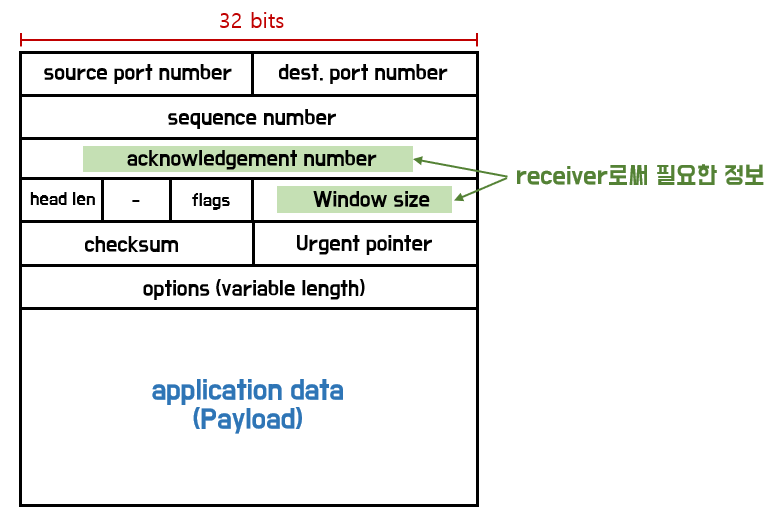

# TCP Flow Control

TCP는 데이터를 신뢰성 있게 전달하기 위해
ACK 기반으로 동작하는 프로토콜입니다.

기본적인 개념으로는 Stop & Wait 방식이 있지만,
이 방식은 전송 효율이 매우 낮습니다.

---

### Stop & Wait

데이터를 하나 전송한 뒤,  
ACK을 받을 때까지 다음 데이터를 보내지 않는 방식입니다.

- 구현은 단순하지만
- 전송 효율이 매우 낮음

> 예시: 택배를 한 개 보내고 수령 확인 후 다음 택배를 보내는 방식  
> → 네트워크 자원을 충분히 활용하지 못하는 비효율적인 방식

---

<br>

## 해결 방법: Sliding Window

Sliding Window는  
한 번에 여러 데이터를 전송하고, ACK을 통해 윈도우를 앞으로 이동시키는 방식입니다.

즉, 데이터를 하나씩 보내고 기다리는 것이 아니라  
**여러 패킷을 연속적으로 전송한 뒤 ACK을 통해 흐름을 제어하는 방식**입니다.

<br>

## Sliding Window 동작 방식

1. sender는 window size만큼 데이터를 연속으로 전송
2. receiver는 데이터를 수신 후 ACK 전송
3. ACK을 받으면 window를 앞으로 이동 (slide)
4. 이동한 만큼 새로운 데이터를 추가로 전송

> 이 과정을 반복하며 데이터 전송

<br>

예시

```
window size = 3

[1][2][3] 전송 → ACK(1) 수신

→ window 이동

[2][3][4] 상태 → 4 전송 가능

→ window가 앞으로 이동하면서 지속적으로 전송됨
```

<br>

## TCP Flow Control

TCP Flow Control은  
**수신 측(receiver)의 버퍼 상태에 맞춰 송신 속도를 조절하는 메커니즘**입니다.

> 즉, sender가 마음대로 보내는 것이 아니라  
> receiver가 수용 가능한 범위 내에서 데이터를 전송합니다.

<br>

## TCP Window

- sender가 한 번에 보낼 수 있는 최대 데이터 크기
- receiver가 자신의 버퍼 상태를 기반으로 window size를 전달

> receiver → sender로 전달됨

<br>



위 그림의 TCP 헤더의 Window Size 필드는  
수신 측이 현재 받을 수 있는 데이터의 크기(rwnd)를 의미합니다.

sender는 이 값을 기반으로  
전송 가능한 데이터 양을 조절합니다.

<br>

## 📌 핵심 정리

- Stop & Wait → 단순하지만 비효율적
- TCP는 Sliding Window 기반으로 동작
- Flow Control은 **receiver의 버퍼 상태를 기준으로 전송량 조절**
- Window Size(rwnd)를 통해 전송 가능 범위를 결정

<br>

> Flow Control은 수신 측의 처리 능력을 초과하지 않도록 하기 위한 메커니즘입니다.
