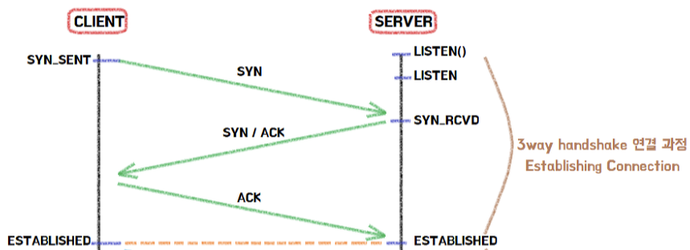
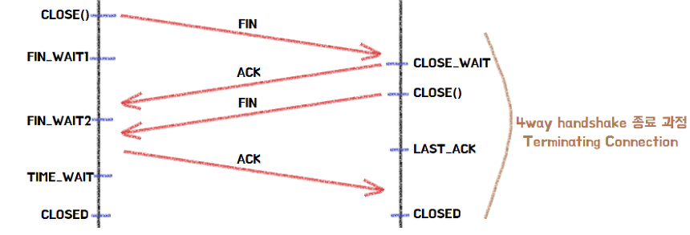

# TCP & UDP

TCP와 UDP는 전송 계층(Transport Layer)에서 사용하는 대표적인 프로토콜입니다.  
전송 계층은 송신자와 수신자 간의 데이터 전달을 담당합니다.

 

## TCP(Transmission Control Protocol)

- 서버와 클라이언트 간 데이터를 신뢰성 있게 전달하기 위한 프로토콜
- 데이터를 전송하기 전에 연결을 설정하는 연결지향형 프로토콜
- 데이터 손실 및 순서를 보장

 

### 특징

#### 1. 연결 지향형

- 3-way handshaking으로 연결 설정
- 4-way handshaking으로 연결 해제

#### 2. 신뢰성 보장

- 데이터 손실, 중복, 순서 문제 해결
- ACK, 재전송 메커니즘 사용

#### 3. 흐름 제어 (Flow Control)

- 수신자의 버퍼 상태를 기반으로 송신 속도 조절
- Window Size를 활용하여 데이터 전송량 조절

#### 4. 혼잡 제어 (Congestion Control)

- 네트워크 혼잡 상태를 감지하여 전송 속도 조절

#### 5. 양방향 통신 (Full Duplex)

- 송신과 수신을 동시에 처리 가능

 

#### 단점

- 연결 설정 과정(Handshake)으로 인한 오버헤드 발생
- 흐름 제어, 혼잡 제어, 재전송 등으로 인해 지연 발생
- 실시간성이 중요한 서비스에는 부적합

 

## TCP 연결, 해제 과정

#### Flag 종류

| FLAG | 설명      |
| ---- | --------- |
| SYN  | 연결 요청 |
| ACK  | 응답 확인 |
| FIN  | 연결 종료 |

 

- ### 3-way handshaking

 

 

1. 클라이언트 → SYN 전송
2. 서버 → SYN + ACK 응답
3. 클라이언트 → ACK 전송 후 연결 성립

 

 

- ### 4-way handshaking

 

 

1. 클라이언트 → FIN 전송
2. 서버 → ACK 응답 (CLOSE_WAIT)
3. 서버 → FIN 전송
4. 클라이언트 → ACK 후 TIME_WAIT → 종료

 

 

## UDP(User Datagram Protocol)

연결 없이 데이터를 데이터그램 단위로 전송하는 비연결형 프로토콜입니다.

 

### 특징

#### 1. 비연결형

- 별도의 연결 과정 없이 데이터 전송

#### 2. 데이터그램 방식

- 각 패킷이 독립적으로 전송됨
- 순서 보장 없음

#### 3. 빠른 전송 속도

- 흐름 제어 및 혼잡 제어 없음
- 재전송 없음 → 지연이 적음

#### 4. 신뢰성 없음

- 패킷 손실, 순서 변경 가능

 

#### 단점

- 데이터 손실 가능성 존재
- 패킷 순서 보장 불가
- 신뢰성 보장이 없기 때문에 애플리케이션 레벨에서 별도 처리 필요

 

## TCP vs UDP (핵심 비교)

| 항목      | TCP         | UDP             |
| --------- | ----------- | --------------- | --- |
| 연결 방식 | 연결형      | 비연결형        |
| 전송 방식 | 스트림 기반 | 데이터그램 기반 |
| 순서 보장 | 보장        | 보장하지 않음   |
| 신뢰성    | 높음        | 낮음            |
| 속도      | 느림        | 빠름            |
| 통신 방식 | 1:1         | 1:1 / 1:N / N:N |     |

 

## 사용 사례

### TCP가 적합한 경우

- 데이터 정확성이 중요한 경우
- 예: 로그인, 금융 시스템, 데이터베이스

### UDP가 적합한 경우

- 실시간성이 중요한 경우
- 예: 게임 동기화, 스트리밍

 

## 📌 핵심 정리

- TCP: 신뢰성과 순서 보장이 중요한 통신에 사용
- UDP: 속도와 실시간성이 중요한 통신에 사용

 

**게임 서버에서는**

> TCP는 로그인/데이터 처리에,  
> UDP는 실시간 위치/전투 처리에 사용될 수 있습니다.
