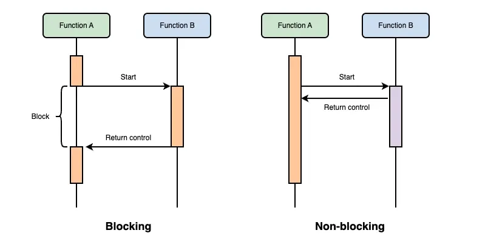
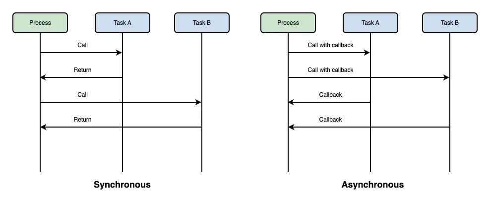
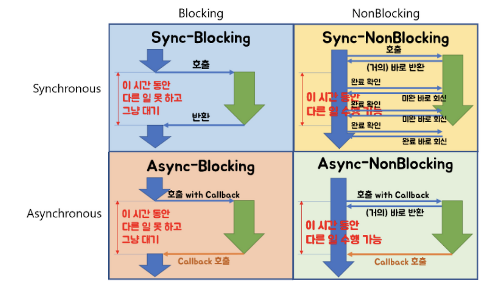

# 블로킹/논블로킹 & 동기/비동기

<br>

## Blocking/Non-blocking

> Blocking / Non-Blocking은 **함수 호출 시 제어권을 언제 반환하느냐의 차이**

- **Blocking**
  - 함수 호출 시 작업이 완료될 때까지 제어권을 넘겨주지 않음
  - 호출자는 대기 상태가 되며 다른 작업을 수행하지 못함

- **Non-Blocking**
  - 함수 호출 시 바로 제어권을 반환
  - 호출자는 대기하지 않고 다른 작업 수행 가능

<br>



**예시**

```
상황: 함수 A가 함수 B를 호출

- Blocking
→ B가 끝날 때까지 A는 대기

- Non-Blocking
→ B를 호출하고 A는 바로 다음 작업 수행
```

<br>

## Synchronous/Asynchronous

> Synchronous / Asynchronous는 **작업 완료를 누가 처리하느냐의 차이**

- **Synchronous (동기)**
  - 작업이 순차적으로 진행됨
  - 호출자가 결과를 직접 기다림

- **Asynchronous (비동기)**
  - 작업이 독립적으로 실행됨
  - 콜백(callback), 이벤트 등을 통해 완료를 통지받음

<br>



**예시**

```
상황: 함수 A가 함수 B를 호출

- Synchronous
→ A는 B가 끝날 때까지 계속 기다림

- Asynchronous
→ A는 B 결과를 기다리지 않고 다른 작업 수행 (B가 끝나면 콜백으로 알려줌)
```

<br>

<br>

## 블로킹/논블로킹 + 동기/비동기 4가지 조합

<br>

<br>

<br>

위 그림과 같이 총 4가지 조합이 존재합니다. 각 Case를 예시를 통해 살펴보겠습니다.

> 예시 상황: 4명이서 배틀그라운드 게임 진행 (나: 1번)

<br>

### 1) Blocking & Synchronous

- 제어권을 넘겨주지 않고 (Blocking)
- 작업 완료를 직접 기다리는 (Sync)

```
나: 2번님 1번 핑 확인해주세요.
(확인 완료까지 기다림)

2번: 확인했어요.

나: 3번님 1번 핑 확인해주세요.
```

> 가장 직관적인 방식  
> 순차 처리

<br>

### 2) Blocking & Asynchronous

- 제어권을 넘겨주지 않고 (Blocking)
- 완료는 나중에 통지받는 (Async)

```
나: 2번님 2번 핑 확인해주세요.
(나는 아무것도 못하고 기다리는 중...)

2번: 확인했어요!
(그제서야 다음 작업 가능)
```

> Async지만 여전히 대기 상태  
> 실무에서는 거의 잘 사용되지 않음

<br>

### 3) Non-blocking & Synchronous

- 제어권은 바로 반환 (Non-Blocking)
- 결과는 계속 확인하며 기다림 (Sync)

```
나: 2번님 1번 핑 확인해주세요.
나: (다른 작업 수행)

나: 확인했어요?
2번: 거의 다 왔어요.

2번: 확인 완료
나: 다음 작업 진행
```

> polling 방식 느낌  
> CPU 낭비 가능성 있음

<br>

### 4) Non-blocking & Asynchronous

- 제어권을 바로 반환 (Non-Blocking)
- 결과를 콜백으로 받음 (Async)

```
나: 2번님 2번 핑 확인해주세요.
나: 3번님 3번 핑 확인해주세요.
나: 4번님 4번 핑 확인해주세요.

(나는 다른 작업 수행 중)

4번: 확인 완료
2번: 확인 완료
3번: 확인 완료
```

> 가장 효율적인 구조  
> 이벤트 기반 / 비동기 프로그래밍

<br>

## 📌 핵심 정리

- Blocking/Non-blocking은 **제어권의 개념**
- Sync/Async는 **작업 완료 처리 방식의 개념**

<br>

> 두 개념은 독립적이며 조합해서 사용됩니다.
