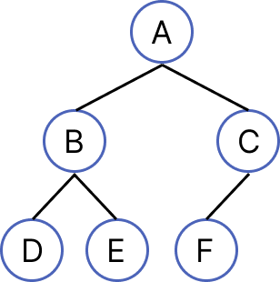
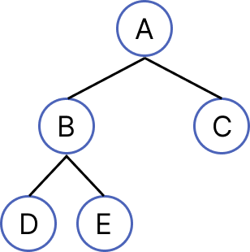
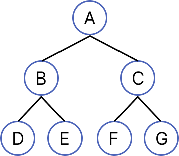

# 트리 (Tree)

## 트리(Tree)란?

트리는 **사이클이 없는 연결 그래프**이며,  
하나의 루트 노드를 기준으로 계층 구조를 표현하는 **비선형 자료구조**이다.

각 노드는 부모-자식 관계를 가지며,  
임의의 두 노드를 잇는 경로는 항상 **유일하다**.

 

## 특징

- 계층적 구조를 표현하는 비선형 자료구조
- 노드들이 트리 형태로 연결된 구조
- 사이클(Cycle)이 존재하지 않음
- 임의의 두 노드 사이의 경로는 하나
- 재귀적인 구조 (트리 안에 서브트리 존재)

 

## 구조 및 용어

#### 구조 및 용어

- **노드 (Node)**: 트리를 구성하는 기본 요소
- **간선 (Edge)**: 노드와 노드를 연결하는 선

- **루트 노드 (Root)**: 가장 상위 노드 (부모 없음)
- **리프 노드 (Leaf)**: 자식이 없는 노드
- **형제 노드 (Sibling)**: 같은 부모를 가지는 노드

 

#### 주요 개념

- **깊이 (Depth)**  
  루트 노드에서 특정 노드까지의 간선 수  
  (루트의 깊이는 0)

- **높이 (Height)**  
  특정 노드에서 리프 노드까지의 최대 거리  
  (트리의 높이 = 루트의 높이)

- **차수 (Degree)**  
  노드의 자식 개수

- **트리의 차수**  
  트리 내 노드 차수의 최댓값

 

- **간선 수 = 노드 수 - 1**

- **경로 (Path)**: 노드 간 이동 경로

- **서브트리 (Subtree)**: 특정 노드를 루트로 하는 트리

## 트리의 종류

### 1. 이진 트리

- #### 완전 이진 트리 (Complete Binary Tree)
    

> 마지막 레벨을 제외하고 모든 레벨이 완전히 채워져 있음  
> 마지막 레벨은 꽉 차 있지 않아도 됨  
> 노드는 왼쪽부터 오른쪽으로 채워져야 함

 

- #### 전 이진 트리 (Full Binary Tree)
    

> 모든 노드가 자식 0개 또는 2개를 가짐

 

- #### 포화 이진 트리 (Perfect Binary Tree)
    

> 모든 레벨이 노드로 꽉 차 있는 트리  
> 전 이진 트리의 성질도 만족 (모든 노드가 0개 혹은 2개의 자식 노드를 갖음)  
> 모든 리프 노드의 깊이가 동일

> 높이가 k일 때 → 노드 개수 = `2^k - 1`

 

### 2. 이진 탐색 트리 (Binary Search Tree, BST)

이진 탐색 트리는 이진 트리에 정렬 조건이 추가된 구조입니다.

 

#### 특징

- 왼쪽 서브트리의 모든 값 < 루트 노드의 값 < 오른쪽 서브트리의 모든 값
- 모든 서브트리 역시 이진 탐색 트리 구조를 만족
- 중위 순회(Inorder Traversal) 시 정렬된 결과를 얻을 수 있음
- 일반적으로 중복 값을 허용하지 않음 (구현에 따라 다를 수 있음)

 

#### 시간 복잡도

- 평균: **O(log N)**
- 최악: **O(N)** (편향 트리 발생 시)

> 데이터가 한쪽으로 치우칠 경우 트리의 높이가 증가하여 성능이 저하될 수 있음

 

### 3. 균형 트리 (Balanced Tree)

트리의 높이를 균형 있게 유지하여 연산 성능을 보장하는 트리

- Red-Black Tree
- AVL Tree
- B-Tree / B+Tree

_자세한 내용는 [균형 트리 (Balanced Tree).md]() 참고_

 

## 순회 방법

#### 1. 전위 순회 (Pre-order traversal)

루트 노드 -> 왼쪽 자식 -> 오른쪽 자식 순서대로 방문하는 순회 방법

> A - B - D - E - C - F - G

#### 2. 중위 순회 (inorder traverse)

왼쪽 자식 -> 루트 노드 -> 오른쪽 자식 순서로 방문하는 순회 방법

> D - B - E - A - F - C - G

#### 3.후위 순회 (Post-order traversal)

왼쪽 자식 -> 오른쪽 자식 -> 루트 노드 순서로 방문하는 순회 방법

> D - E - B - F - G - C - A

 

## 📌 핵심 정리

- 트리는 **사이클이 없는 연결 그래프**
- 노드 간 경로는 항상 하나
- **간선 수 = 노드 수 - 1**
- 재귀적 구조 (서브트리)
- BST는 평균 O(logN), 최악 O(N)
- 균형 트리는 성능을 보장하기 위해 사용됨
