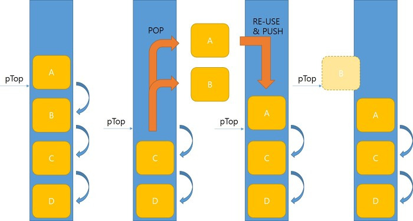

# 락프리(Lock-Free) 프로그래밍

## Lock-Free란?

락(Lock)을 사용하지 않고도 여러 스레드가 동시에 안전하게 데이터를 처리하는 동시성 프로그래밍 기법입니다.

기존 Lock 방식과 차이는  
**적어도 하나의 스레드는 항상 작업을 진행할 수 있음**을 보장하는 것입니다.

> Lock: 한 번에 한 명만 들어갈 수 있는 화장실 (대기 발생)  
> Lock-Free: 계속 회전하는 회전문 (멈추지 않음)

<br>

## 왜 필요한가?

멀티스레드 환경에서 mutex 기반 동기화(Lock)는 다음과 같은 문제가 발생합니다.

- context switch 발생 → 성능 저하
- lock contention → 스레드 대기 증가
- 커널 진입 비용 발생

> 즉, lock 기반 구조는 고성능 환경에서 병목이 될 수 있음  
> 이를 해결하기 위해 Lock-Free 방식이 사용

<br>

## Lock-Free 동작 원리

- ### Lock 기반 방식

1. mutex 획득
2. 다른 스레드 접근 차단
3. 작업 수행
4. mutex 해제

> 문제: 대기 + context switch 발생

<br>

- ### Lock-Free 방식

1. 현재 값 읽기
2. 값 변경 시도 (CAS)
3. 성공 시 작업 완료
4. 실패 시 재시도 (retry loop)

> 핵심: CAS (Compare-And-Swap)

---

## CAS (Compare-And-Swap)

CAS는 기대값과 현재값을 비교하여  
같으면 새로운 값으로 변경하는 원자적 연산입니다.

### 코드 예시

```cpp
// addr: 변경할 메모리 위치
// expected: 기대값
// desired: 새로운 값
bool CAS(int* addr, int expected, int desired) {
    if (*addr == expected) {
        *addr = desired;
        return true;
    }
    return false;
}
```

<br>

#### 장점

- lock 없이 동기화 가능
- context switch 없음
- 높은 성능

#### 단점

- 실패시 반복 재시도로 CPU 사용 증가 (busy-wait)
- **ABA 문제** 발생 가능

---

### ABA 문제

CAS는 현재 값과 기대값을 비교하여 동일하면 값을 변경하는 연산입니다.

하지만 포인터 기반 자료구조에서는  
값이 A → B → A로 변경되면  
CAS는 이를 "변경되지 않았다"고 판단하는 문제가 발생할 수 있습니다.

이를 **ABA 문제**라고 합니다.

<br>

- #### 예시 (Lock-Free Stack)


1. 스레드 1이 pTop을 A로 읽고, 다음 노드 B를 저장
2. 스레드 2가 A와 B를 모두 Pop하고 해제
3. 이후 A의 주소를 재사용하여 새로운 A를 Push
4. 스레드 1이 다시 실행되면 pTop이 여전히 A라고 판단
5. 하지만 실제로는 이전 A가 아닌 "다른 A"
6. 이미 해제된 B를 Top으로 설정 → 오류 발생

<br>

> 중간 변경(A → B → A)을 감지하지 못함
> 메모리 재사용으로 인해 잘못된 상태 발생

<br>

### ABA 문제 해결법

#### 1. DCAS (Double Compare-And-Swap)

CAS의 한계를 보완하기 위해  
값뿐만 아니라 추가적인 정보(version, counter 등)를 함께 비교하는 방식입니다.

즉, 단순히 값이 같은지만 보는 것이 아니라  
“값 + 변경 이력”을 함께 확인하여 중간 변경을 감지합니다.

- 주소 + 추가 데이터 함께 비교
- version 또는 counter 사용

<br>

#### 2. Hazard Pointer

포인터가 아직 사용 중인 상태에서 메모리가 해제되는 것을 방지하기 위한 기법입니다.

각 스레드는 자신이 사용 중인 포인터를 별도로 기록하고,  
다른 스레드는 해당 포인터가 사용 중인지 확인한 후에만 메모리를 해제합니다.

즉, 사용 중인 메모리를 재사용하지 않도록 하여  
ABA 문제를 근본적으로 방지합니다.

- 사용 중인 포인터를 별도 관리
- 사용 중인 메모리는 즉시 해제하지 않음

> Hazard Pointer 단점  
> 매번 검사하면 비용이 크기 때문에  
> 일정량 모아서 처리하는 방식 사용

---

### SpinLock은 Lock-Free인가?

SpinLock의 경우 LockFree라고 할 수 없습니다.

SpinLock은 busy-wait 기반이지만  
여전히 lock을 사용하는 방식입니다.

> SpinLock은 특정 스레드가 멈추면 다른 스레드도 계속 대기  
> Lock-Free는 **적어도 하나의 스레드 진행 보장**

즉, SpinLock은 이 조건을 만족하지 못함

<br>

- _자세한 비교는 [동기화 방식 비교 (Mutex vs SpinLock vs Lock-Free)](<../C++/동기화 방식 비교 (Mutex vs SpinLock vs Lock-Free).md>) 참고_

---

<br>

## Lock-Free 장단점

### 장점

- lock 오버헤드 없음
- context switch 없음
- 데드락 없음

### 단점

- 구현 난이도 높음
- 디버깅 어려움
- ABA 문제 등 추가 문제 존재
- busy-wait로 CPU 사용 증가

<br>

## 게임 서버에서 활용

> 게임 서버에서는 고성능 처리가 중요하기 때문에
> Lock-Free 구조가 사용될 수 있습니다.

- IO 처리 큐
- 이벤트 큐

<br>

## 📌 핵심 정리

- Lock-Free는 락 없이 동시성을 해결하는 방식
- CAS를 기반으로 동작
- 높은 성능 제공

하지만

- ABA 문제 발생 가능
- 구현 난이도 높음
- busy-wait로 인한 CPU 사용 증가

<br>

> 따라서 Lock-Free는 항상 좋은 선택은 아니며  
> 상황에 맞게 선택적으로 사용해야 합니다.
